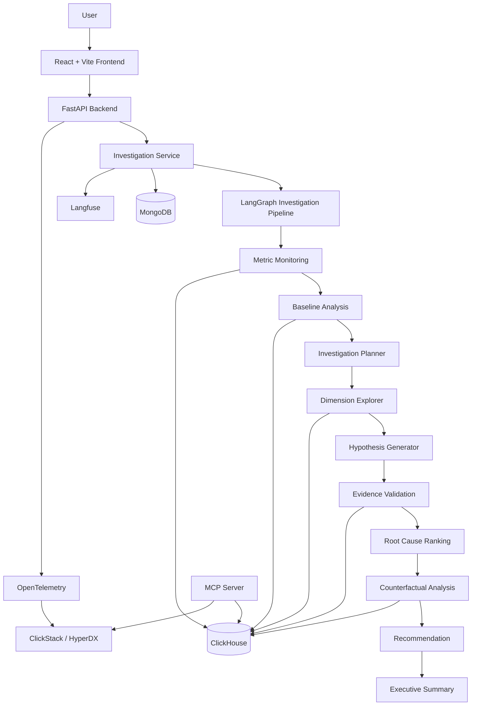

# CH-AdNova

## Team Name

**CH-Spark**

## Track

**InMobi**

## Project

### CH-AdNova — AI-Powered Ad Analytics & Root Cause Investigation

An intelligent advertising analytics platform that uses ClickHouse and a multi-agent AI investigation pipeline to automatically detect metric anomalies, identify root causes, validate evidence, and recommend actionable solutions.

## Team Members

* **Kathirdhasan A** (https://github.com/kathirdhasan-A)
* **Gayathri M** (https://github.com/GayathriMeganathan18)
* **Dhivyadharshini M** (https://github.com/Dhivya-qunatrail)

## What it does

CH-AdNova is an AI-powered advertising analytics and investigation platform designed to help teams understand **why important advertising metrics change or degrade**.

Instead of manually exploring dashboards and running multiple SQL queries, a user can start an investigation for a metric such as **revenue, fill rate, CTR, or eCPM**. The platform automatically analyzes the data and produces an evidence-backed investigation.

The system:

1. Detects whether a metric is anomalous compared with a historical baseline.
2. Identifies which stage of the advertising funnel is responsible.
3. Dynamically selects the most relevant dimensions to investigate.
4. Analyzes dimensions such as:

   * App
   * Advertiser
   * Geography
   * Device
   * OS
   * Ad format
5. Identifies concentrated segments contributing to the problem.
6. Ranks potential root causes using computed confidence scores.
7. Validates hypotheses using evidence and counterfactual analysis.
8. Explicitly records dimensions and hypotheses that were ruled out.
9. Generates actionable recommendations.
10. Produces an executive-friendly investigation summary.
11. Traces the investigation pipeline using Langfuse and OpenTelemetry.
12. Provides SQL evidence behind the investigation results.

The key design principle is that **the LLM does not calculate business metrics**. Revenue, fill rate, CTR, eCPM, deltas, confidence, and business impact are calculated from ClickHouse data and deterministic application logic. The LLM is used only for narrative generation and explanation.

## Hosted Demo

**Live Demo:** [https://ch-adnova-frontend.vercel.app/]

## Demo Video

**Demo Video:** [https://drive.google.com/file/d/12V1odzg5aykHbsTPPPvf55sOt_V1YcXN/view?usp=sharing]

The demo video showcases:

* Starting an investigation.
* Metric anomaly detection.
* Funnel-stage analysis.
* Dynamic dimension exploration.
* Root-cause ranking.
* Ruled-out hypotheses.
* Counterfactual validation.
* Recommendations.
* Executive summary.
* Observability and investigation tracing.

## Architecture



### Main Components

#### Frontend

The React frontend provides the user interface for:

* Dashboard and KPI monitoring.
* Starting new investigations.
* Viewing investigation progress.
* Agent execution timeline.
* Funnel analysis.
* Dimension exploration.
* SQL evidence.
* Root-cause ranking.
* Confidence scores.
* Counterfactual analysis.
* Recommendations.
* Investigation history.

#### FastAPI Backend

The backend exposes APIs for:

* Starting investigations.
* Retrieving investigation results.
* Listing previous investigations.
* Health monitoring.

Main endpoints:

```text
POST /api/investigate
GET  /api/investigations
GET  /api/investigations/{investigation_id}
GET  /health
```

#### LangGraph Investigation Engine

The investigation engine coordinates multiple specialized agents.

The pipeline dynamically determines the investigation path instead of blindly running the same analysis every time.

The system can:

* Detect anomalies.
* Analyze historical baselines.
* Identify broken funnel stages.
* Plan investigation order.
* Explore dimensions.
* Generate hypotheses.
* Validate evidence.
* Rank root causes.
* Perform counterfactual analysis.
* Generate recommendations.
* Produce an executive summary.

#### ClickHouse

ClickHouse is the primary analytics database.

The advertising event data is stored in a wide fact table with dimensions flattened into the event data for efficient analytical queries.

The architecture also uses:

* `MergeTree`-based tables.
* `AggregatingMergeTree` rollups.
* Materialized views.
* Projections.
* TTL-based staging data cleanup.
* Pre-aggregated hourly and dimensional analytics.

This allows investigation agents to query optimized analytical structures instead of repeatedly scanning the complete raw event dataset.

#### MongoDB

MongoDB stores investigation results and historical investigation records.

This enables users to retrieve previous investigations and review the complete analysis later.

#### Langfuse

Langfuse provides tracing for AI-related investigation workflows.

An investigation can be tracked as a trace, with individual agent executions represented as spans.

#### ClickStack / HyperDX

ClickStack provides observability for the application using OpenTelemetry.

The backend and MCP server export telemetry to ClickStack, enabling developers to monitor application behavior and investigate system-level issues.

#### MCP Server

The MCP server provides an AI-accessible interface to the ClickHouse analytics data and is designed to allow MCP-compatible AI clients to interact with the advertising analytics system.

## How we built it

### Frontend

* React 18
* Vite
* React Router
* Tailwind CSS
* Apache ECharts
* Axios

### Backend

* Python
* FastAPI
* Uvicorn
* Pydantic
* ClickHouse Connect

### AI & Agent Orchestration

* LangGraph
* LangChain Core
* Anthropic Claude
* Multi-agent investigation workflow

### Data & Storage

* ClickHouse
* MongoDB
* PostgreSQL

### Observability

* Langfuse
* OpenTelemetry
* ClickStack / HyperDX

### Infrastructure

* Docker
* Docker Compose
* Nginx

### Interesting Implementation Details

#### 1. The LLM does not calculate metrics

The system intentionally separates deterministic analytics from natural-language generation.

Metrics such as:

* Revenue
* Fill rate
* CTR
* eCPM
* Percentage changes
* Confidence scores
* Business impact

are calculated using ClickHouse query results and deterministic Python logic.

The LLM is only responsible for explaining already-computed results.

This prevents hallucinated numbers from appearing in the investigation.

#### 2. Dynamic investigation planning

The investigation is not a fixed sequence of SQL queries.

The planner examines the broken funnel stage and dynamically determines which dimensions should be investigated first.

This makes the investigation process more efficient and focused.

#### 3. Root-cause validation

The platform does not simply identify a suspicious segment and call it the root cause.

Potential causes are validated using evidence and counterfactual analysis.

The system can also explicitly identify and display hypotheses that were ruled out.

#### 4. Pre-aggregated ClickHouse analytics

ClickHouse materialized views and aggregation tables are used to accelerate common analytical queries.

This reduces the amount of raw event data that agents need to scan during investigations.

#### 5. Observability-first architecture

Each investigation can be observed through application traces and agent-level execution telemetry.

This makes it easier to understand:

* Which agent ran.
* What queries were executed.
* How the investigation progressed.
* Where failures occurred.
* How long individual steps took.

## How to run it

### Prerequisites

Install:

* Docker
* Docker Compose
* Git

Make sure Docker is running before starting the project.

### 1. Configure environment variables

Create or update the `.env` file in the project root.

At minimum, configure the ClickHouse credentials consistently across the services.

Example:

```env
CLICKHOUSE_DB=ch_adnova
CLICKHOUSE_USER=ch_adnova_admin
CLICKHOUSE_PASSWORD=root

BACKEND_PORT=8000
FRONTEND_PORT=5173

CLICKSTACK_UI_PORT=8080
CLICKSTACK_OTLP_HTTP_PORT=4318
CLICKSTACK_OTLP_GRPC_PORT=4317

MCP_SERVER_PORT=8001

LANGFUSE_PORT=3001
POSTGRES_PORT=5433
MONGO_PORT=27017
```

Optional AI and observability credentials can also be configured:

```env
ANTHROPIC_API_KEY=<your-anthropic-api-key>
ANTHROPIC_MODEL=<your-model>

LANGFUSE_PUBLIC_KEY=<your-langfuse-public-key>
LANGFUSE_SECRET_KEY=<your-langfuse-secret-key>

CLICKSTACK_INGESTION_KEY=<your-clickstack-ingestion-key>
```

> Never commit real API keys, passwords, or ingestion keys to GitHub.

### 2. Add the dataset

Place the required source data files in the project's data directory.

```text
data/
├── apps.txt
├── advertisers.txt
├── geo_device.txt
└── ad_events.parquet
```

### 3. Start the infrastructure

From the project root:

```bash
docker compose up --build -d
```

Check running containers:

```bash
docker compose ps
```

### 4. Load the ClickHouse data

Make the loader executable:

```bash
chmod +x clickhouse/load/load_data.sh
```

Run the data loader:

```bash
./clickhouse/load/load_data.sh
```

### 5. Verify the ClickHouse data

Run the validation script:

```bash
docker exec -i ch-adnova-clickhouse \
  clickhouse-client \
  --database=ch_adnova \
  --multiquery < clickhouse/load/validate.sql
```

### 6. Check the backend

Open:

```text
http://localhost:8000/health
```

Expected response:

```json
{
  "status": "ok",
  "clickhouse": "up"
}
```

### 7. Open the frontend

Open:

```text
http://localhost:5173
```

The frontend should now be available for starting and reviewing investigations.

### 8. Run an investigation

You can start an investigation using the API:

```bash
curl -X POST http://localhost:8000/api/investigate \
  -H "Content-Type: application/json" \
  -d '{
    "metric": "revenue",
    "target_date": "2026-01-15",
    "baseline_days": 7
  }'
```

Make sure the selected `target_date` exists in the loaded dataset.

To find the available date range:

```bash
docker exec -it ch-adnova-clickhouse \
  clickhouse-client \
  --database=ch_adnova \
  --query="SELECT min(toDate(event_time)), max(toDate(event_time)) FROM ad_events"
```

### 10. Access observability tools

#### ClickStack / HyperDX

```text
http://localhost:8080
```

#### Langfuse

```text
http://localhost:3001
```

#### Backend API

```text
http://localhost:8000
```

#### Frontend

```text
http://localhost:5173
```

## Project Structure

```text
CH-AdNova/
├── backend/
│   ├── app/
│   │   ├── agents/
│   │   │   ├── baseline_analysis.py
│   │   │   ├── counterfactual.py
│   │   │   ├── dimension_explorer.py
│   │   │   ├── evidence_validation.py
│   │   │   ├── executive_summary.py
│   │   │   ├── hypothesis_generator.py
│   │   │   ├── investigation_planner.py
│   │   │   ├── metric_attribution.py
│   │   │   ├── metric_monitoring.py
│   │   │   ├── recommendation.py
│   │   │   ├── root_cause_ranking.py
│   │   │   └── graph.py
│   │   ├── repositories/
│   │   ├── routers/
│   │   ├── services/
│   │   ├── observability/
│   │   └── main.py
│   ├── tests/
│   ├── Dockerfile
│   └── requirements.txt
│
├── clickhouse/
│   ├── init/
│   └── load/
│
├── frontend/
│   ├── src/
│   │   ├── components/
│   │   ├── pages/
│   │   └── api/
│   ├── Dockerfile
│   └── package.json
│
├── mcp-server/
│   ├── server.py
│   ├── Dockerfile
│   └── requirements.txt
│
├── docker-compose.yml
├── .env
└── README.md
```

## Testing

Backend tests can be run with:

```bash
cd backend
pip install -r requirements.txt
pytest -v
```

The test suite covers:

* Agent pipeline behavior.
* Root-cause identification.
* ClickHouse metric calculations.
* Fill rate calculation.
* CTR calculation.
* eCPM calculation.

The agent smoke tests use a deterministic fake repository to validate the investigation workflow without requiring a live ClickHouse deployment.

## Key Metrics

CH-AdNova focuses on common advertising performance metrics:

### Fill Rate

```text
Fill Rate = Filled Impressions / Ad Requests × 100
```

### CTR

```text
CTR = Clicks / Impressions × 100
```

### eCPM

```text
eCPM = Revenue / Impressions × 1000
```

These metrics are used by the investigation pipeline to determine where advertising performance has degraded and which segments are contributing to the change.

## Why CH-AdNova?

Traditional analytics dashboards tell teams **what changed**.

CH-AdNova is designed to answer:

> **What changed, why did it change, what evidence supports the cause, what was ruled out, and what should we do next?**

By combining ClickHouse's high-performance analytical capabilities with a dynamic multi-agent investigation engine, CH-AdNova turns raw advertising data into an explainable, evidence-backed root-cause investigation.
