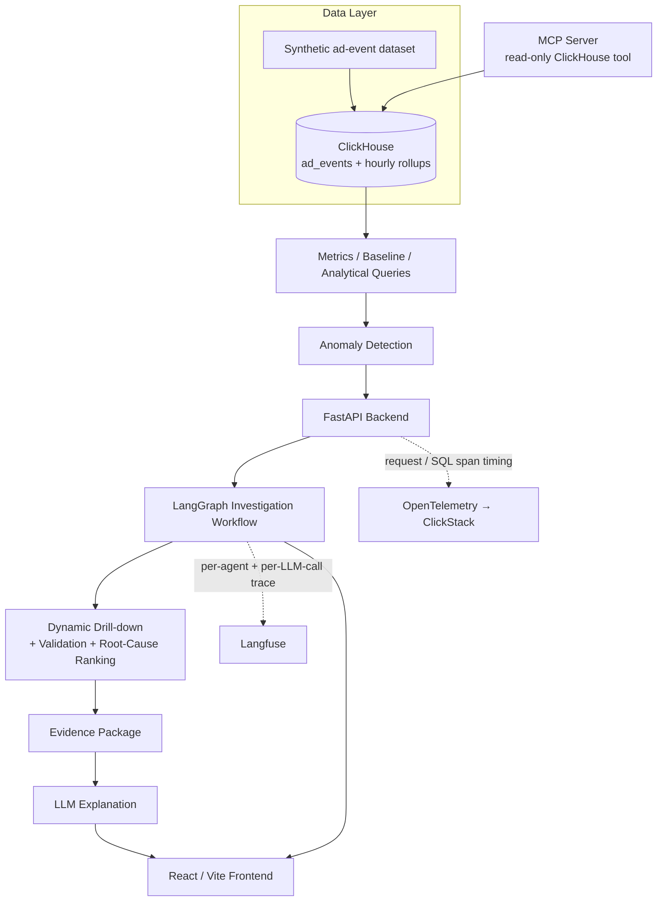

# CH-AdNova — Agentic Root Cause Investigation for Ad Metrics

CH-AdNova investigates abnormal movements in advertising metrics — revenue,
fill rate, CTR, eCPM — and returns a short, evidence-backed explanation of
what changed and which segment is responsible. It moves the workflow from
*"the dashboard shows a drop"* to *"here is the drop, the segment behind it,
and the evidence for that conclusion,"* without a human manually pivoting
through dashboards to find it.

**Detect → Investigate → Localize → Validate → Explain → Trace**

| Phase | Contents | Status |
|---|---|---|
| 1 | `clickhouse/`, `data/` — schema, rollups, data loader | Built, documented, run-instructions in `RUNBOOK.md` |
| 2 | `backend/` — FastAPI + 12-agent LangGraph pipeline | Built. Every file passes `py_compile`; the full agent chain was logic-verified end-to-end against a deterministic fake ClickHouse repo (see `backend/PHASE2_README.md`). **Not yet run against a live Docker stack** — I don't have Docker/network access in the environment I built this in. |
| 3 | `frontend/`, `mcp-server/` | Built this session. Frontend passes a balanced-syntax sanity check but **has not been through `npm install && vite build`** — no JS package registry access in my environment. MCP server passes `py_compile`. |
## The problem

Monitoring can tell you *that* something changed: revenue is down 12% today,
fill rate dipped in the last hour. It cannot tell you *why*, or *which*
segment — which app, region, device, advertiser, or format — is actually
responsible. Getting that answer today means manually drilling through
dashboards across every dimension, one at a time, hoping to spot the segment
that moved. It's slow, and it doesn't leave behind a reusable trail of what
was checked or why a conclusion was reached.

## The solution

CH-AdNova runs that investigation automatically:

1. Ad event data lives in ClickHouse — a fact table plus pre-aggregated
   hourly rollups per dimension.
2. Standard metrics (requests, fills, fill rate, impressions, clicks, CTR,
   revenue, eCPM) are computed directly from those tables.
3. A historical baseline is established for the target metric and date.
4. Deviations from that baseline trigger an investigation.
5. A LangGraph pipeline plans which dimensions to check, in what order,
   based on which part of the funnel actually broke — not a fixed scan.
6. It drills into the dimensions that look responsible and calculates each
   segment's contribution to the overall movement.
7. Candidate explanations are validated by recomputing the metric with the
   suspect segment excluded, and ranked by confidence and business impact.
8. The result — an evidence package of numbers, SQL, and ranked causes — is
   handed to an LLM whose only job is to phrase it as a short explanation.
9. Every agent step and LLM call in the investigation is traced.

## Architecture



MongoDB persists each finished investigation (and detected alerts) so the
frontend's History and Alerts pages can list past runs without re-querying
ClickHouse. The MCP server is a small, separate read-only tool (list tables,
describe a table, run a guarded `SELECT`) for ad-hoc exploration of the same
ClickHouse schema — it is not part of the investigation pipeline itself.

## How the automated investigation works

```
Anomaly detected
    ↓
Analyze the metric's funnel (which stage broke: requests / fill rate / CTR / eCPM)
    ↓
Plan which dimensions to check, and in what order, based on that
    ↓
Query ClickHouse per dimension, drilling deeper where signal concentrates
    ↓
Calculate each segment's contribution to the overall deviation
    ↓
Validate candidate causes (recompute the metric excluding that segment)
    ↓
Rank root causes by confidence and business impact
    ↓
Generate a natural-language explanation from the evidence
    ↓
Trace the run
```

This runs as a multi-agent LangGraph workflow — a chain of purpose-built
agents (metric monitoring, baseline analysis, planning, dimension
exploration, recursive drill-down, attribution, hypothesis generation,
evidence validation, root-cause ranking, counterfactual simulation,
recommendation, and summary) rather than one large prompt. The planner
reorders which dimension gets checked next based on what the funnel check
found, and the explore loop can stop early once a dimension's top
contributor is clearly concentrated — the investigation order is decided
step by step, not fixed in advance.

## Dynamic drill-down

Investigations can pivot across:

- **App** — app ID, category, publisher tier
- **Region** — region, country
- **Device** — device model, OS version
- **Advertiser** — advertiser ID, vertical, campaign type
- **Ad format**

For each dimension, the platform ranks segments by how much of the overall
metric's deviation they account for, so the investigation converges on
*which* app, region, device, advertiser, or format is actually driving the
movement — rather than reporting the change without a locus.

## Evidence-first AI

Raw event data — the ~9M-row `ad_events` table — is never sent to the LLM.
It stays in ClickHouse. All metric calculation and dimensional drill-down
happen there in SQL; only the resulting structured numbers (baseline,
actual, delta, share of deviation, confidence) are passed to the LLM. The
LLM's role is narration — turning already-computed evidence into a short,
readable explanation — not arithmetic.

```
Raw Events (ClickHouse) → SQL Aggregation → Computed Evidence → LLM → Explanation
```

This doesn't make the numbers hallucination-proof, but it removes the LLM
from the calculation path entirely: every figure in an explanation traces
back to a specific query result, and the same query run again reproduces the
same number. If no `ANTHROPIC_API_KEY` is configured, agents fall back to a
deterministic template built from the same evidence, so an investigation
still completes with plain prose instead of LLM-written narrative.

## Traceability

Each investigation opens one Langfuse trace, with one span per agent in the
pipeline and a separate "generation" record for each actual LLM call
(prompt, completion, and model used). This is what's inspectable in
Langfuse: which agents ran, in what order, how long each took, and what an
LLM was asked versus what it returned.

SQL query latency (per ClickHouse call) and request-level timing are
recorded separately through OpenTelemetry and viewable in ClickStack — that
detail is not duplicated into Langfuse.

## Frontend

A React + Vite + Tailwind CSS application, charted with ECharts:

- **Dashboard** — KPI cards with sparklines, metric trend charts, a
  dependency tree, a revenue deviation calendar, live alerts, and a
  time-series forecast, filterable by time range, app, region, and
  publisher tier.
- **New Investigation** — pick a metric and date, run an investigation, and
  view the result: funnel check, dimension exploration, ranked root causes,
  a counterfactual simulation, recommendations, and an agent-by-agent replay
  timeline.
- **History** — past investigations.
- **Alerts** — anomalies detected by the background monitor or a manual
  check, each with an "Investigate with AI" action that opens a
  conversational follow-up seeded with that anomaly's context.

## Dataset

The bundled synthetic dataset (`data/`):

| File | Documented rows |
|---|---|
| `ad_events.parquet` | ~9,000,000 |
| `apps.txt` | 2,000 |
| `advertisers.txt` | 500 |
| `geo_device.txt` | 5,000 |

spanning roughly five weeks of events. Each raw event represents one ad
request moving through the funnel: **Request → Fill → Impression → Click →
Revenue**, with `is_filled` / `is_impression` / `is_click` flags and a
`revenue` value on every row. These counts describe the supplied source
files; actual row counts after loading depend on running the loader against
your own ClickHouse instance and can be confirmed with `clickhouse/load/validate.sql`.

## Metrics

Computed directly in ClickHouse from the funnel columns above:

| Metric | Formula |
|---|---|
| Requests | count of ad requests |
| Fills | count where `is_filled` |
| Fill Rate | Fills / Requests |
| Impressions | count where `is_impression` |
| Render Rate | Impressions / Fills |
| Clicks | count where `is_click` |
| CTR | Clicks / Impressions |
| Revenue | sum of `revenue` |
| eCPM | Revenue / Impressions × 1000 |
| Revenue per Request | Revenue / Requests |

The investigation and anomaly-detection pipeline currently operates on
**Requests, Fills, Fill Rate, Impressions, Clicks, CTR, Revenue, and eCPM**
— Render Rate and Revenue per Request are standard funnel metrics shown here
for completeness but aren't yet part of the monitored/investigated set.

## Technology stack

| Layer | Technology |
|---|---|
| Analytical database | ClickHouse |
| Backend API | FastAPI |
| Investigation orchestration | LangGraph |
| LLM narration | Anthropic Claude (optional; template fallback if unset) |
| Agent/LLM observability | Langfuse |
| Request/SQL tracing | OpenTelemetry → ClickStack (HyperDX) |
| Investigation trace storage | MongoDB |
| Frontend | React + Vite |
| Charts | ECharts |
| Styling | Tailwind CSS |
| Ad-hoc data exploration | MCP server (FastMCP, read-only ClickHouse tool) |
| Orchestration | Docker Compose |

## Project structure

```
ch-adnova/
├── docker-compose.yml
├── .env.example
├── PHASE1_README.md            # ClickHouse schema design rationale
├── docs/
│   └── ARCHITECTURE.md         # system diagram + data flow
├── clickhouse/
│   ├── init/                   # dimension tables, staging, fact table, rollups
│   └── load/                   # load_data.sh, validate.sql
├── data/                       # ad_events.parquet, apps.txt, advertisers.txt, geo_device.txt
├── backend/
│   ├── app/
│   │   ├── agents/             # LangGraph investigation agents + graph.py + state.py
│   │   ├── analytics/          # baseline engine, anomaly detector, timeseries/forecast
│   │   ├── repositories/       # all ClickHouse SQL, Mongo stores
│   │   ├── routers/            # health, metrics, analytics, investigate, monitor, chat, system
│   │   ├── schemas/            # Pydantic contracts
│   │   ├── services/           # investigation + monitor orchestration
│   │   └── observability/      # Langfuse tracer, OTel setup, LLM client
│   ├── tests/
│   ├── docs/langgraph_flow.md
│   ├── PHASE2_README.md
│   └── Dockerfile
├── frontend/
│   ├── src/
│   │   ├── components/         # KPI cards, charts, root-cause/evidence panels, chat
│   │   ├── pages/               # Dashboard, Investigate, History, Alerts, Chat
│   │   └── api/client.js
│   └── Dockerfile
└── mcp-server/                  # read-only ClickHouse SQL tool over MCP
    ├── server.py
    └── Dockerfile
```

## Quick start

Works the same on Linux, macOS, and Windows via WSL — the data loader is a
Bash script, so Windows users should run it from **WSL** or **Git Bash**
rather than PowerShell.

```bash
# 1. Environment
cp .env.example .env
# Optionally set ANTHROPIC_API_KEY in .env for LLM-written narrative text —
# every agent has a deterministic fallback, so this is not required to run.

# 2. Make sure the dataset is in place
ls data/   # expects ad_events.parquet, apps.txt, advertisers.txt, geo_device.txt

# 3. Start the stack
docker compose up --build -d

# 4. Load the dataset into ClickHouse (first run only)
bash clickhouse/load/load_data.sh
# Windows: run the above from a WSL or Git Bash terminal, not PowerShell.

# 5. Verify
curl http://localhost:8000/health
```

Once healthy:

| Service | URL |
|---|---|
| Frontend | http://localhost:5173 |
| Backend health | http://localhost:8000/health |
| Langfuse | http://localhost:3001 |
| ClickStack | http://localhost:8080 |

For environment-variable details and deeper troubleshooting, see
`PHASE1_README.md` (ClickHouse/data), `backend/PHASE2_README.md`
(backend/agents), and `docs/ARCHITECTURE.md` (system-level).

## Example investigation

A generic illustration of the flow, not a result from this dataset:

```
Revenue deviation detected
    ↓
Funnel check identifies which stage moved (e.g. fill rate)
    ↓
Relevant dimensions investigated (app, region, device, advertiser, format)
    ↓
Responsible segment localized (e.g. a specific region or device segment)
    ↓
Other candidate segments checked and ruled out
    ↓
Evidence-backed diagnosis with confidence and business impact
```

## Design principles

- **ClickHouse-first analytics** — every number an agent reasons about is a
  ClickHouse query result, not something computed in Python or by an LLM.
- **Deterministic, evidence-based calculations** — the same query against
  the same data reproduces the same number.
- **Dynamic investigation** — which dimension gets checked next depends on
  what the previous step found, not a fixed scan order.
- **Evidence before narration** — the LLM explains computed evidence; it
  does not calculate it.
- **Traceability** — every agent step and LLM call is recorded against the
  investigation that produced it.
- **Readiness for unseen incidents** — the pipeline reasons from whatever
  deviation and dimension data it's given, rather than being tuned to one
  specific, expected anomaly.

## Documentation

- `PHASE1_README.md` — ClickHouse schema design rationale
- `backend/PHASE2_README.md` — backend/agent design, API surface
- `backend/docs/langgraph_flow.md` — LangGraph flow diagram and routing logic
- `docs/ARCHITECTURE.md` — system architecture diagram and data flow

## Built for

**Click-a-thon 2026 — InMobi Challenge**
*"From alert to answer: the automated root-cause analyst."*
