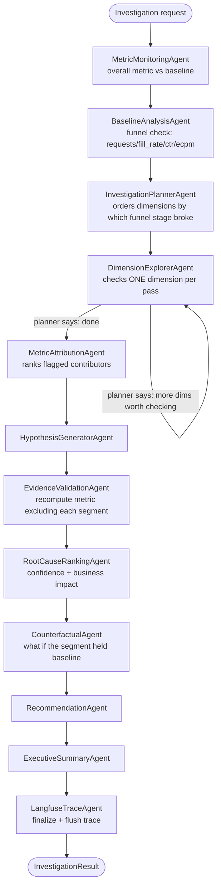

**Where the "dynamic, not random scan" requirement lives:**
`InvestigationPlannerAgent.run()` reorders the 5 candidate dimensions
(app/advertiser/geo/device/format) based on *which funnel stage* broke
(`_abnormal_stages` from `BaselineAnalysisAgent`) — e.g. a fill-rate break
checks device/geo first, a CTR break checks app/format first.
`InvestigationPlannerAgent.route()` is the conditional edge evaluated after
every `DimensionExplorerAgent` pass: it can stop early once a dimension's
top contributor is heavily concentrated (`>= 1.5x` the concentration
threshold) after at least 2 dimensions have been checked, or continue to
the next dimension in the planner's order. Nothing about *what* gets
queried next is decided before the previous agent's result comes back.
