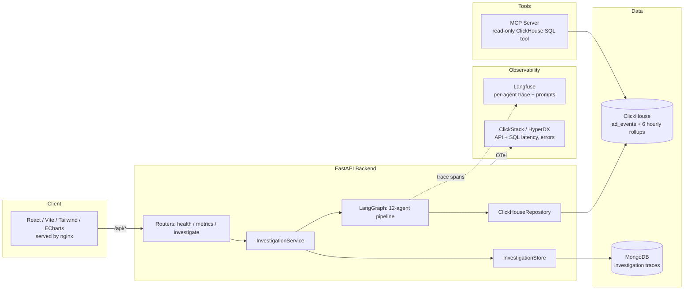

# CH-AdNova — Architecture



## Three phases, three deliverables

1. **ClickHouse (`clickhouse/`, `data/`)** — denormalized `ad_events` fact table
   + 6 hourly `AggregatingMergeTree` rollups (overall/app/advertiser/geo/device/format).
   All agent math traces back to these tables; nothing is computed by an LLM.
2. **Backend (`backend/`)** — FastAPI + the 12-agent LangGraph investigation
   pipeline. See `backend/PHASE2_README.md` and `backend/docs/langgraph_flow.md`
   for the agent-by-agent design and why the investigation order is dynamic,
   not a fixed scan.
3. **Frontend (`frontend/`) + MCP server (`mcp-server/`)** — the dashboard,
   investigation trigger UI, and a companion read-only ClickHouse tool for
   ad-hoc exploration outside the fixed investigation flow.

## Data flow for one investigation

```
User picks metric + date
    -> POST /api/investigate
    -> InvestigationService builds initial state, opens a Langfuse trace
    -> LangGraph runs 12 agents in sequence (with a dynamic explore-loop)
    -> every agent's SQL + reasoning + confidence is logged to state.agent_log
    -> InvestigationService persists the full result to MongoDB
    -> response renders in <InvestigationResultView/> on the frontend
    -> Langfuse trace + ClickStack spans are viewable independently
```
